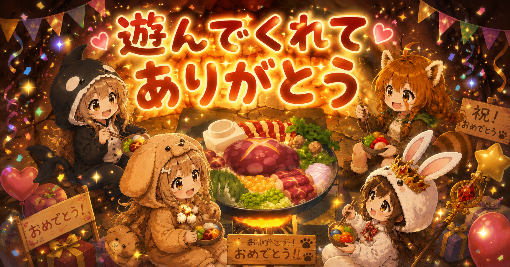

# 株クラRPG（仮称） — 仕様書 v2.1

## 0. 概要

みっちゃん主催の合同企画。ブラウザで遊べる詠唱タイピングゲーム。

**タイトルは「株クラRPG」（仮称）。** 確定次第、以下の3箇所を差し替える。
タイトル画面の見出し / X共有文面 / OGP メタタグ。
この3箇所以外にタイトル文字列をハードコードしないこと（定数 `TITLE` に切り出す）。

プレイヤー（＝遊んでいる本人）が、4人のメンバーに順番に挑戦する。
呪文は投資用語（英字）。株クラのフォロワーが遊ぶことを想定する。

### 役割分担

| 担当 | 作業 |
|---|---|
| にむし | 実装・デプロイ・修正 |
| 各メンバー | 自分の画像とセリフ3種を提出 |

### 設計方針

- **合同企画である。4人の間に上下関係・強弱の序列を一切作らない**
- 詰まって離脱されるのが最悪の結果。難易度は低く倒す
- 遊んだ人が X に投稿することで、4人それぞれのフォロワー層に拡散する構造にする
- **素材が1件も揃っていない状態でも完成・公開できる構造にする**
- プレイ時間は 4〜6 分で完結させる

### 明示的にスコープ外とするもの

- サーバー、DB、ログイン、オンラインランキング
- プレイヤー名の入力
- BGM・効果音（ブラウザの自動再生制限で必ず詰まる）
- スマートフォン対応（タイピングのため PC 前提）
- 歩行・攻撃アニメーション（静止画＋発光エフェクトのみ）
- ゲームオーバー画面（後述のとおり失敗しても進行は失われない）

---

## 1. 技術スタック

| 項目 | 選定 |
|---|---|
| 構成 | **`index.html` 単一ファイル**（CSS / JS を内包） |
| フレームワーク | なし（バニラ JS） |
| ビルド | なし |
| 画像 | 同階層に PNG を配置し `` で参照 |
| 保存 | localStorage（自己ベストのみ） |
| デプロイ | GitHub Pages（リポジトリに置くだけ） |

**React も Vite も使わない。** ビルド不要の1ファイル構成にすることで、実装・修正・デプロイのコストをすべて最小化する。ファイルをダブルクリックすれば動く状態を保つこと。

```
index.html
assets/
  micchan.png
  nimushi.png
  nempan.png
  ponkotsu.png
```

**必ず新規の空ディレクトリで作業を開始すること。**

---

## 2. データ構造（最重要）

`index.html` の `<script>` 先頭に、以下の2ブロックを置く。
**素材の差し替えはこのブロックのみで完結させ、ロジックには一切触れない。**

### 2-1. キャラクター定義

キャラに紐づくのは **画像とセリフ3種のみ**。強さ・呪文・難易度は一切持たせない。

```js
const CHARACTERS = [
  {
    id: "micchan",
    name: "みっちゃん",
    handle: "@xxxxx",
    image: "assets/micchan.png",  // 未提出なら null
    emoji: "🔮",                   // image が null のときの代替表示
    entryLine:   "いくよー！",       // 登場時
    defeatLine:  "つよいね……！",     // プレイヤーが勝ったとき
    victoryLine: "またおいでね",     // 時間切れ（プレイヤーが負けたとき）
  },
  { id: "nimushi",  name: "にむし",       handle: "@nimushi666", image: null, emoji: "🌱", entryLine: "", defeatLine: "", victoryLine: "" },
  { id: "nempan",   name: "ねむぱん",     handle: "@xxxxx",      image: null, emoji: "🍞", entryLine: "", defeatLine: "", victoryLine: "" },
  { id: "ponkotsu", name: "ポンコツ女王", handle: "@xxxxx",      image: null, emoji: "👑", entryLine: "", defeatLine: "", victoryLine: "" },
];
```

**フォールバック規則**

| 未設定の項目 | 代替 |
|---|---|
| `image` が `null` | `emoji` を 160px で表示 |
| `entryLine` が空 | 「いくよ！」 |
| `defeatLine` が空 | 「またやろうね」 |
| `victoryLine` が空 | 「もういっかい挑戦してね」 |

これにより、**セリフも画像も1件も届いていない状態でゲームが完動する。**
締切時点で集まった分だけでリリースし、後から差し替える。

### 2-1-b. 勝敗による表情変化（フェーズ11）

画像差分があれば使い、なければ CSS フィルタで代替する。**差分画像は必須にしない。**

```js
image:        "assets/nimushi.png",    // 通常（登場時・戦闘中）
imageDefeat:  null,                     // プレイヤーが勝ったとき
imageVictory: null,                     // プレイヤーが負けたとき（時間切れ）
```

**3段フォールバック**

1. 該当する差分画像があればそれを使う
2. なければ `image` に CSS フィルタをかける
3. `image` も `null` なら絵文字に同じフィルタをかける

| 状態 | CSS |
|---|---|
| 負けたとき（撃破画面） | `filter: grayscale(0.6)` ＋ 4px 下にずらす |
| 勝ったとき（時間切れ画面） | `filter: brightness(1.15)` ＋ 1.05 倍に拡大 |

**差分画像がゼロ枚でも勝敗の違いが伝わる**ことがこの設計の要件。
メンバーへの依頼では「差分があれば嬉しいが、なくても問題ない」と明示する。

### 2-2. 呪文プール

呪文は **戦闘順（＝難易度）に紐づく。キャラには紐づけない。**
4つの Tier に分け、その順番に対応する Tier からランダムに出題する。

```js
const SPELL_TIERS = [
  [ { w: "INDEX", ja: "指数" }, ... ],   // 1番手
  [ ... ],                                // 2番手
  [ ... ],                                // 3番手
  [ ... ],                                // 4番手
];
```

---

## 3. 登場順とランダム化

ゲーム開始時に `CHARACTERS` を**シャッフルして4人の登場順を1回だけ決定する。**

- 難易度は「何番手か」で決まる。誰と戦うかは難易度に影響しない
- **リトライ・時間切れで再抽選しないこと。** ステージ途中で相手が入れ替わるバグになる
- 4番手のみ「最後の相手」演出を入れる（第6章）

これにより、**誰も永久にラスボスにならず、誰も永久に雑魚にならない。** 序列そのものが発生しない。

---

## 4. 難易度テーブル

| 順番 | 呪文の長さ | 出題数 | 制限時間 |
|---|---|---|---|
| 1番手 | 4〜6文字 | 5問 | 60秒 |
| 2番手 | 7〜11文字 | 6問 | 60秒 |
| 3番手 | 12〜16文字 | 6問 | 60秒 |
| 4番手 | 15〜20文字 | 7問 | **70秒** |

4番手だけ制限時間を伸ばすのは、長文で時間切れが頻発すると企画として失敗するため。

### 時間切れの扱い

- **そのステージのみタイマーをリセットして再開する**
- 進行状況（すでに倒した相手）は失われない
- ゲームオーバー画面は作らない
- 煽る表現を使わない。相手の `victoryLine` を出して静かに再挑戦させる

---

## 5. 呪文リスト

すべて英字と半角スペースのみ。**記号・数字は使用しない**（`S&P500` の `&` はキーボード配列で位置が異なり、詰まる人が出る）。

### Tier 1（4〜6文字 / 1番手）

`INDEX`(指数) `YIELD`(利回り) `HOLD`(保有) `RISK`(リスク) `BONDS`(債券) `NISA`(ニーサ) `CASH`(現金) `TREND`(相場の流れ) `STOCK`(株式) `GROWTH`(成長) `VALUE`(割安) `IDECO`(イデコ)

### Tier 2（7〜11文字 / 2番手）

`DIVIDEND`(配当) `COMPOUND`(複利) `DRAWDOWN`(最大下落率) `PORTFOLIO`(資産配分) `BEAR MARKET`(下落相場) `BULL MARKET`(上昇相場) `VOLATILITY`(変動率) `LONG TERM`(長期) `BLUE CHIP`(優良株) `RECESSION`(景気後退) `INFLATION`(物価上昇) `INDEX FUND`(指数連動投信)

### Tier 3（12〜16文字 / 3番手）

`TOTAL RETURN`(総合収益) `CAPITAL GAINS`(売却益) `MARKET TIMING`(売買タイミング) `EXPENSE RATIO`(信託報酬) `PROFIT TAKING`(利益確定) `SHARPE RATIO`(シャープレシオ) `TAX DEFERRAL`(課税繰延) `RISK TOLERANCE`(リスク許容度) `EMERGENCY FUND`(生活防衛資金) `ASSET ALLOCATION`(資産配分) `EMERGING MARKETS`(新興国市場)

### Tier 4（15〜20文字 / 4番手）

`DIVERSIFICATION`(分散投資) `COMPOUND INTEREST`(複利効果) `ALL COUNTRY INDEX`(全世界株式) `PASSIVE INVESTING`(パッシブ運用) `LONG TERM HOLDING`(長期保有) `FINANCIAL FREEDOM`(経済的自由) `DOLLAR COST AVERAGE`(ドルコスト平均法) `CAPITAL PRESERVATION`(資産保全)

### 注意

- 最長20文字を上限とする。それ以上は爽快感より作業感が勝つ
- 投資助言と受け取られる表現は入れない。用語とその訳のみに留める

---

## 6. 画面構成

固定 **960 × 640 px**。ウィンドウ中央に配置。

### 6-1. タイトル画面

```
┌────────────────────────────────────────┐
│                                        │
│         株クラRPG                        │
│                                        │
│   投資の呪文を詠唱して、4人に挑戦しよう     │
│                                        │
│    🔮        🌱        🍞        👑      │
│  みっちゃん  にむし   ねむぱん   女王      │
│                                        │
│        [ はじめる（Enter） ]              │
│                                        │
│  ⚠ 日本語入力（IME）はOFFにしてください     │
│                                        │
│   自己ベスト: 3分12秒 / 正確率 96%        │
└────────────────────────────────────────┘
```

**IME の警告は必須。** 日本語入力がONだと `keydown` が `Process` を返して1文字も入力できない。案内がないと「壊れている」と判断されて終わる。株クラの利用者は通常日本語入力なので、確実に踏む。

### 6-2. 戦闘開始（1.5秒）

```
        1人目 —— にむし

          「いくよー！」
```

### 6-3. ゲーム画面

```
┌────────────────────────────────────────┐
│  1人目 / 4         にむし  ♥♥♥♥♥         │
│                                        │
│                      [相手スプライト]     │
│                                        │
│                                        │
│           C O M P O U N D              │  ← 打鍵済みは緑、未入力は暗茶
│              ‾                          │  ← 次に打つ1文字にアンダーライン
│              （複利）                    │
│                                        │
│   ⏱ 52秒   COMBO 12   正確率 94%         │
└────────────────────────────────────────┘
```

- 呪文を打ち切ると相手のハートが1つ減り、画面中央に円形の光を 150ms 表示
- ハートが0になったら撃破

### 6-4. 撃破画面

```
        にむし に勝利！

          「またやろうね」

     ⏱ 28秒 / 正確率 96%

     [ Xで報告する ]   [ 次へ（Enter） ]
```

**撃破ごとに個別の共有ボタンを置くこと。** 1人のプレイヤーが最大4回投稿する。
「にむしに勝った」という投稿はにむしのフォロワーに届くため、**4人それぞれのフォロワー層へ別々にリーチできる。** これが本企画の主要な拡散経路。

### 6-5. 最後の相手（4番手のみ）

3人撃破済みの状態で4人目に入るとき、通常の戦闘開始演出の代わりに以下を挟む。

- 背景を `#0E0A08` に暗転（0.5秒）
- 「—— 最後の相手 ——」を表示（1秒）
- 相手名と `entryLine` を表示（1.5秒）

**誰が4番手になるかは毎回変わるため、4人全員に「誰かにとってのラスボス」になる機会がある。**
実装は「撃破数が3のときにフラグを立てる」だけ。追加は10行程度。

### 6-6. クリア画面

```
        ✨ コンプリート ✨

     クリアタイム   3分12秒
     最大コンボ     28
     正確率         96%

  ────────────────────────

   🔮 みっちゃん @xxxxx
   🌱 にむし     @nimushi666
   🍞 ねむぱん   @xxxxx
   👑 ポンコツ女王 @xxxxx

  ────────────────────────

   [ Xで結果を投稿 ]  [ もう一度あそぶ ]
```

**4人全員のXリンクを必ず表示する。** これが企画のゴール。

### 6-7. フィナーレ集合画像

クリア画面の最上部に、**別途用意する集合画像1枚**を表示する。

```html

```

| 項目 | 仕様 |
|---|---|
| ファイル | `assets/finale.png` |
| 推奨サイズ | 1200 × 630 px（OGP と兼用できる） |
| 表示 | 幅 100%、高さ自動。0.6秒でフェードイン |
| 内容 | 4人の集合＋「遊んでくれてありがとう！ 株クラRPG 一同より」 |

#### 未提出時のフォールバック

`finale.png` が存在しない場合でもクリア画面が崩れないこと。

- 画像の `onerror` で非表示にし、代わりにテキストのみを表示する
- 表示するテキスト：`遊んでくれてありがとう！` / `株クラRPG 一同より`

**この画像を待って実装やリリースを止めないこと。**

#### 画像として保存できるようにする

集合画像の下に「画像を保存」ボタンを置く。`finale.png` をそのままダウンロードさせるだけでよい。

```html
<a href="assets/finale.png" download="kabukura-rpg.png">画像を保存</a>
```

canvas での描画・合成は不要。

#### X共有と画像の関係（重要）

`twitter.com/intent/tweet` では**画像を自動添付できない。** これはXの仕様であり回避できない。
投稿に画像を出す方法は次の2つのみ。

| 方法 | 動作 |
|---|---|
| **OGP画像（推奨）** | URLを貼るだけでカードとして自動表示される |
| 手動添付 | 保存ボタンで落とした画像をユーザーが自分で添付する |

**OGP を必ず設定すること。** これが実質的な画像の露出経路になる。

```html
<meta property="og:title" content="株クラRPG">
<meta property="og:description" content="投資用語をタイピングして4人に挑戦しよう">
<meta property="og:image" content="https://<公開URL>/assets/ogp.png">
<meta property="og:type" content="website">
<meta name="twitter:card" content="summary_large_image">
```

`assets/ogp.png` は 1200 × 630 px。**集合画像をそのまま流用してよい**（`finale.png` と同一ファイルで構わない）。

**OGP画像はXにキャッシュされる。** 差し替えても即座には反映されないため、公開前に確定させておくこと。反映されない場合は Card Validator でキャッシュを更新する。

---

## 7. 入力判定

- `keydown` で1文字ずつ判定する
- **大文字小文字は区別しない**（画面は大文字表示、入力は小文字でよい）
- スペースを含む呪文はスペースキーで入力する
- 一致 → 1文字進む、COMBO +1、正打数 +1
- 不一致 → **文字は進まない。COMBO を 0 にリセットし、ミス数 +1**

### ミスタイプによる時間減点（−3秒）

ミス1回につき、そのステージの残り時間を **3秒** 減らす。

- 減点は `MISS_PENALTY_MS = 3000` という定数に切り出す（調整するのはこの1箇所のみ）
- 残り時間が0以下になったら、通常の時間切れ処理に合流する
- **カーソルは進まない。** 減点は時間のみに作用し、進行は止めない
- 減点が発生したことを視覚的に示す（残り秒数を 200ms `#A83A2E` に点滅させる程度）

#### この数値の根拠

4番手は70秒で7問・約119打鍵。−3秒なら**約23回ミスで時間切れ**になる。

| 減点 | 時間切れに必要なミス数（4番手） | 評価 |
|---|---|---|
| −1秒 | 約70回 | 乱打しないと到達しない。実質無意味 |
| **−3秒** | **約23回** | 初心者は負ける、中級者は勝てる境界 |
| −5秒 | 約14回 | 初心者が確実に詰む |

**「負け画面（時間切れ演出）を実際に見せる」ことが導入目的である。**
バランス調整の際は、この目的に照らして `MISS_PENALTY_MS` を上下させる。

### 進行は止めない

ミスでカーソルは進まないが、失敗にもならない。厳格な判定はタイピング練習ゲームの設計であり、企画の目的と異なる。ミスは正確率と残り時間にのみ反映させる。

### 判定対象外とするキー（ミスにもカウントしない）

- 修飾キー単体（Shift / Ctrl / Alt / Meta）
- 矢印キー、Tab、Esc、Function キー
- `e.key.length !== 1` のもの全般（IME の `Process` もここで弾かれる）

### IME 検出

ゲーム開始後5秒間に有効な打鍵が1度もない場合、画面上部に警告を再表示する。

```
日本語入力がONになっていませんか？ 半角英数に切り替えてください
```

---

## 8. スコア

| 項目 | 定義 |
|---|---|
| クリアタイム | 4戦の合計経過時間（リトライ分も加算） |
| 最大コンボ | 全編通しての連続正打数の最大値 |
| 正確率 | `正打数 / (正打数 + ミス数)` を四捨五入して整数% |

localStorage に保存するのは以下のみ。

```json
{ "bestTimeMs": 192340, "bestAccuracy": 96, "bestCombo": 28 }
```

### X共有

```
https://twitter.com/intent/tweet?text=<encodeURIComponent(文面)>&url=<ゲームURL>
```

**撃破時の文面**

```
「株クラRPG」
にむし に勝利！
⏱ 28秒 / 正確率 96%
```

**クリア時の文面**

```
「株クラRPG」コンプリート！
⏱ 3分12秒 / 最大コンボ 28 / 正確率 96%

投資用語をタイピングして4人に挑戦するゲームです
```

---

## 9. カラーパレット

| 用途 | HEX |
|---|---|
| 背景 | `#1E1812` |
| 暗転（最後の相手） | `#0E0A08` |
| パネル | `#2A1A12` |
| 枠線 | `#6E4A2E` |
| 本文テキスト | `#E8D4B0` |
| 打鍵済み文字 | `#8FBF5A` |
| 未入力文字 | `#6E4A2E` |
| 強調・数値 | `#D4A03C` |
| 相手HP（ハート） | `#A83A2E` |

---

## 10. 実装フェーズ

**動作確認できる単位で止めること。フェーズを飛ばして進めない。**

| # | 内容 | 完了条件 |
|---|---|---|
| 1 | データブロック + タイトル画面 + 画面遷移の骨組み | Enter でゲーム画面に遷移する |
| 2 | 呪文表示 + 入力判定 + 文字の色変化 | 呪文を打ち切ると次の呪文に進む |
| 3 | 登場順シャッフル + HP + 4戦の進行 | 4人倒すとクリア画面に到達する |
| 4 | タイマー + 時間切れリトライ + コンボ + 正確率 | 数値が正しく集計・表示される |
| 5 | 撃破画面 + 個別X共有 | 投稿画面が正しい文面で開く |
| 6 | クリア画面 + 4人のリンク + localStorage | 再訪時に自己ベストが表示される |
| 7 | フィナーレ集合画像 + フェードイン + 保存リンク | 画像が出る。無い場合はテキストのみで崩れない |
| 8 | 最後の相手演出 | 4番手のみ暗転演出が入る |
| 9 | 画像フォールバック + 発光エフェクト + IME警告 | 画像が null でも絵文字で成立する |
| 10 | OGP メタタグ + `assets/ogp.png` | Card Validator でカードが表示される |
| 11 | ミス減点（−3秒）+ 勝敗による表情変化 | ミスで残り時間が減る。勝敗で見た目が変わる |

**フェーズ11はフェーズ10が完動してから着手する。** 実装途中に仕様変更を挟むと、それまでの動作確認の前提が崩れる。

フェーズ9まではすべて絵文字で進めてよい。**画像待ちで実装を止めないこと。**

---

## 11. 動作確認項目

1. 日本語入力ONの状態でキーを叩いても、ミスとしてカウントされない
2. 大文字入力（Shift併用）でも正しく判定される
3. スペースを含む呪文がスペースキーで進む
4. 時間切れになっても、すでに倒した相手は復活しない
5. 時間切れ後の再開で、登場順が再抽選されない
6. `image` が `null` のキャラが絵文字で正しく表示される
7. `entryLine` などが空文字のキャラでデフォルト文言が出る
8. 正確率が初期表示で `NaN` にならない
9. X共有の文面が URL エンコードされ、改行が壊れない
10. リロードしても自己ベストが残る
11. 同じ呪文が1戦の中で重複出題されない
12. タイトル文字列が定数 `TITLE` の1箇所のみで定義されている
13. `finale.png` が存在しない状態でも、クリア画面がテキストのみで崩れずに表示される
14. OGP が Card Validator で正しく表示される

### フェーズ11の確認項目

15. ミス1回で残り時間がちょうど3秒減る
16. 残り時間が3秒未満のときにミスしても、負数表示や二重処理にならない
17. ミス減点で0秒になった瞬間の打鍵で、撃破処理と時間切れ処理が同時に走らない
18. 減点が発生してもカーソル位置が進まない
19. 差分画像がすべて `null` の状態で、CSS フィルタによる勝敗の差が視認できる
20. 差分画像を1枚だけ設定した状態でも、他のキャラが崩れない

---

## 12. 各メンバーへの依頼項目

**キャラに紐づくのは以下4点のみ。** 呪文・難易度は依頼しない。

| # | 項目 | 例 |
|---|---|---|
| ① | アイコン画像 | 今使っているものでOK |
| ② | 登場時のセリフ（1行） | 「私の積立は止まらないよ」 |
| ③ | 負けたときのセリフ（1行） | 「またやろうね」 |
| ④ | 勝ったときのセリフ（1行） | 「もういっかい挑戦してね」 |
| ⑤ | （任意）勝ち顔・負け顔の差分画像 | **なくても成立する。無理に依頼しない** |

締切を設定し、**その時点で集まった分だけでリリースする。**
未提出分はデフォルト値で動くため、企画そのものは止まらない。
